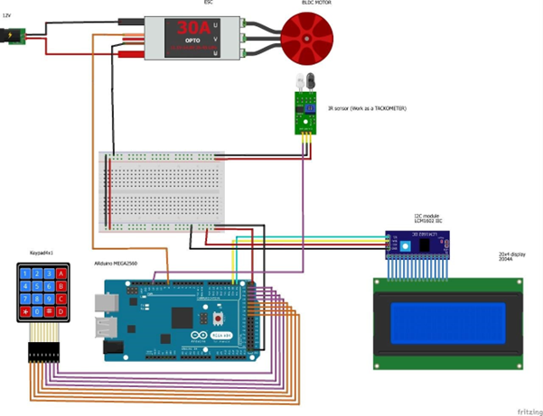

# Low Cost Spin Coater

This project provides a low-cost solution for a spin coater using an Arduino. The system allows users to input the desired RPM and duration, and it automatically controls the spin coater to achieve the specified parameters.

## Features

- **RPM Control**: Users can input the desired RPM (with a maximum of 5000 RPM).
- **Duration Control**: Users can input the duration in minutes (with a minimum of 1 minute).
- **Real-time RPM Display**: The LCD displays the current RPM during operation.
- **User-Friendly Interface**: Simple keypad-based input with options to start or cancel the operation.

## Hardware Requirements

- **Arduino UNO R3** (or any compatible Arduino board)
- **20x4 I2C LCD Display**
- **4x4 Keypad**
- **ESC (Electronic Speed Controller)**
- **BLDC Motor**
- **IR Sensor** (used as a tachometer)
- **12V Power Supply**
- **Miscellaneous**: Breadboard, wires, resistors, etc.

## Circuit Diagram

Refer to the circuit diagram below to correctly wire the components:



## Installation

### Step 1: Clone the Repository

First, clone this repository to your local machine:

```bash
git clone https://github.com/Apu-Emdad/Spin-Coater
cd spin-coater
```

### Step 2: Install Arduino IDE

If you don't already have the Arduino IDE installed, download and install it from the official [Arduino website](https://www.arduino.cc/en/software/).

### Step 3: Install Required Libraries

The project uses the following Arduino libraries:

- **LiquidCrystal_I2C**: For the I2C LCD display.
- **Keypad**: For reading input from the keypad.
- **Servo**: For controlling the ESC.

You can install these libraries directly from the Arduino IDE:

1.  Open the Arduino IDE.
2.  Go to `Sketch > Include Library > Manage Libraries...`.
3.  In the Library Manager, search for the following libraries and install them:
    - `LiquidCrystal_I2C`
    - `Keypad`
    - `Servo`

### Step 4: Upload the Code

1.  Open the `spin_coater.ino` file in the Arduino IDE.
2.  Select your Arduino board (e.g., Arduino Mega 2560) from the `Tools > Board` menu.
3.  Select the correct port from the `Tools > Port` menu.
4.  Click on the upload button (right arrow icon) to upload the code to your Arduino.

### Step 5: Connect the Hardware

Connect all the hardware components according to the circuit diagram. Double-check the connections to avoid any issues.

### Step 6: Run the Spin Coater

1.  Once the code is uploaded, power up your Arduino.
2.  Follow the on-screen instructions on the LCD:
    - **Enter RPM**: Use the keypad to enter the desired RPM (maximum 5000 RPM).
    - **Enter Duration**: Use the keypad to enter the duration in minutes (minimum 1 minute).
    - Press `*` to start the spin coater or `#` to cancel.
3.  The system will display the current RPM in real-time and stop once the set duration has passed.

### Step 7: Debugging & Troubleshooting

- If the LCD display doesn’t turn on, double-check the wiring and I2C address.
- Ensure that all connections are secure and components are functioning properly.

## Contributing

Feel free to contribute to this project by opening issues or submitting pull requests. For major changes, please open an issue first to discuss what you would like to change.

## Acknowledgments

Special thanks to the open-source community for providing libraries and resources that made this project possible.
